# GuiaDebian - Um guia de instalação do debian

&#32;&#32;<em>Alguns passos nesse guia poderá não ser destacado por algumas parte da intalação ser de fácil entedimento.</em>

  
 
1 - Primeiramente: Você deve baixar um programa para virtualizar o seu sitema operacional. Usaremos aqui o virtual-box por exemplo 

 <a href="https://www.virtualbox.org/wiki/Downloads">Dowload Virtual-box</a>
   

 
2 - Segundo: Baixe a iso do Debian

  <a href="https://cdimage.debian.org/debian-cd/current/amd64/iso-cd/">Download Debian10</a>  

  
3 - Crie uma nova maquina virtual clicando em "Novo"

  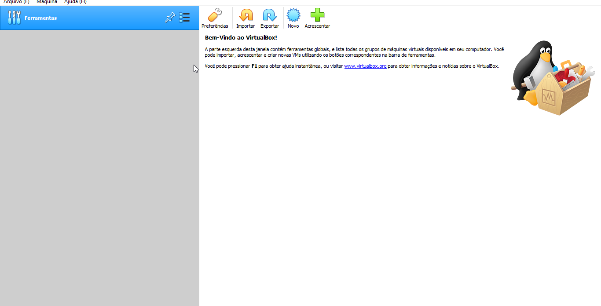
  
  
  
4 - Adicione o nome da sua maquina, como por exemplo "Debian10".

  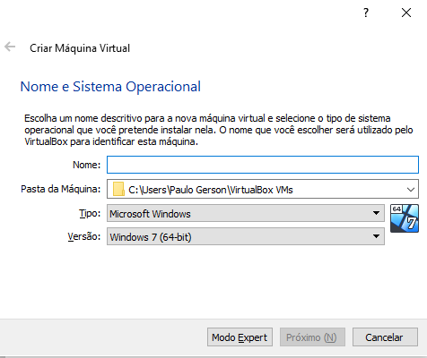
    

   
5 - Coloque uma quantidade de memoria que você veja que não travara. Recomendo colocar de 4GB para frente, mas faça de acordo com o que você possui. 

  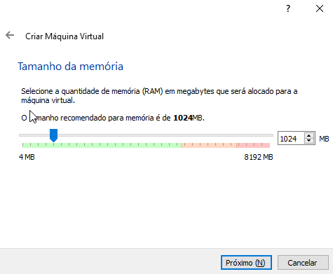
    

   
6 - Deixe a opção de "Criar um novo disco..." e depois clique em "Criar"

  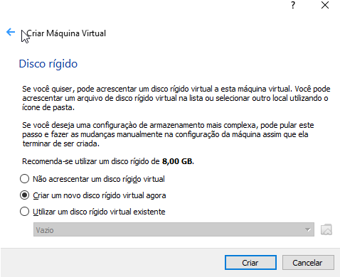
    

  
7 - Deixe a opção de "VDI" e depois clique em "proximo"

  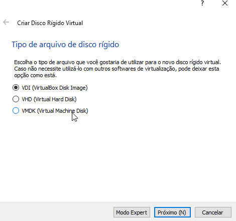
    

  
8 - Deixe a opção de "Dinamicamente alocado" e depois clique em "proximo"

  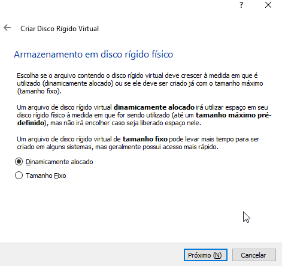
    

  
9 - Defina o tamanho de memoria que ira ser alocada para sua maquina virtual. Requisito minimo recomendado seria de 10GB em diante. 

  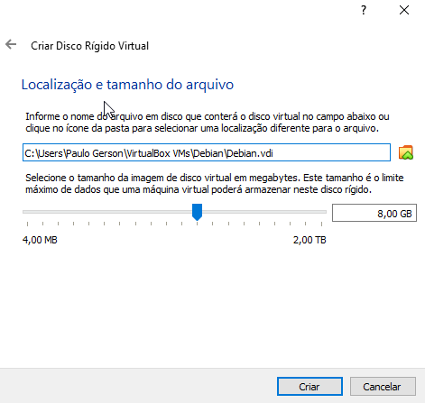
    

  
10 - Clique duas vezes sobre sua maquina virtual para iniciar. 

  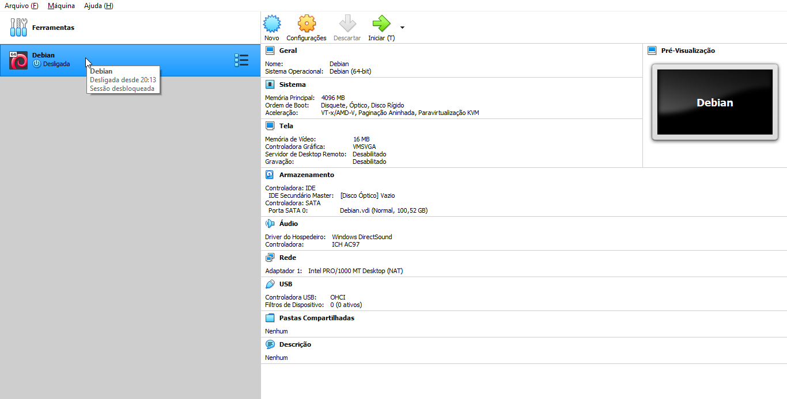
    

  
11 - Escolha a iso do debian que já esta baixada em seu computador. 

  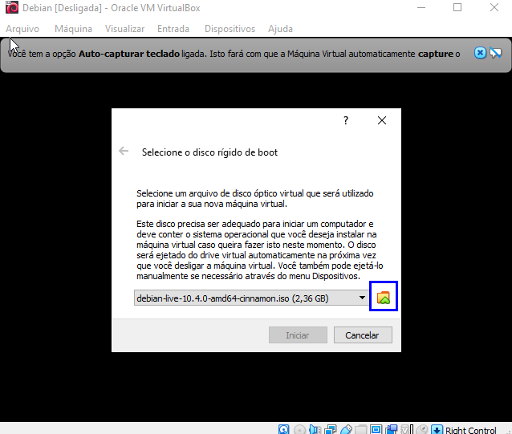
    

   
11.1 - Caso você não consiga adicionar sua iso atravez do passo "11", Vá nas configurações e tente adicionar pelo menu de armazenamento. 

  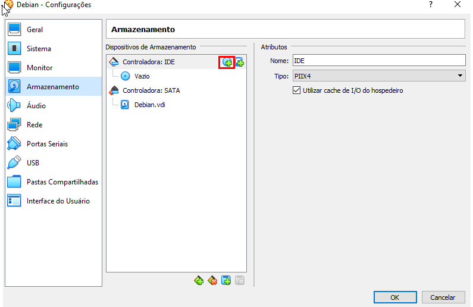
    

  
11.1 - Após adicionando, ira aparecer esse menu em sua tela.  A partir dai você ira escolher o tipo de instalação. No nosso caso iremos instalar o com interface grafica, ou seja a "Graphical Debian".

  
    

  
12 - Os opções a seguir serão todas relacionadas a idiomas, escolha de acordo com sua preferência. No meu caso, escolherei todas Português-Brasil.

  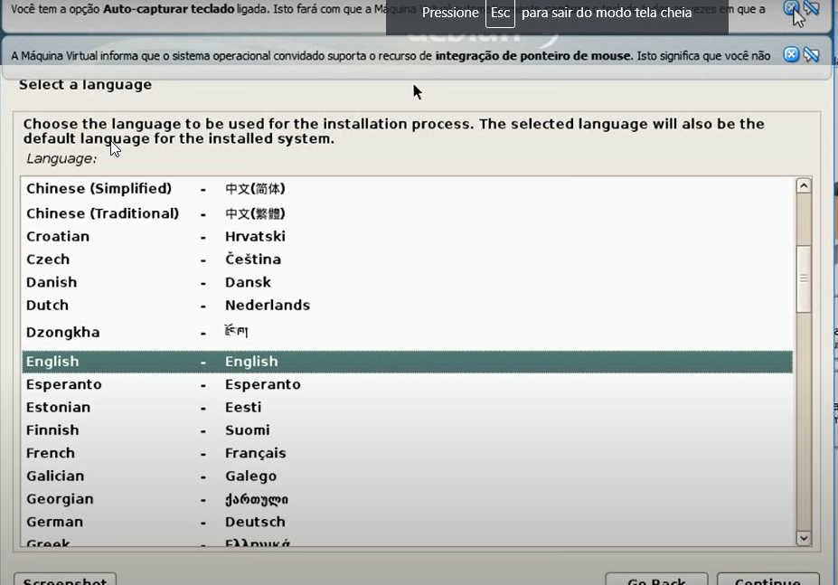
    

  
13 - Escolha um nome qualquer para sua maquina. Caso você não tenha conhecimento sobre o que fazer na tela seguinte e não quiser também colocar uma senha, você poderá pular, que é o que eu fiz.

  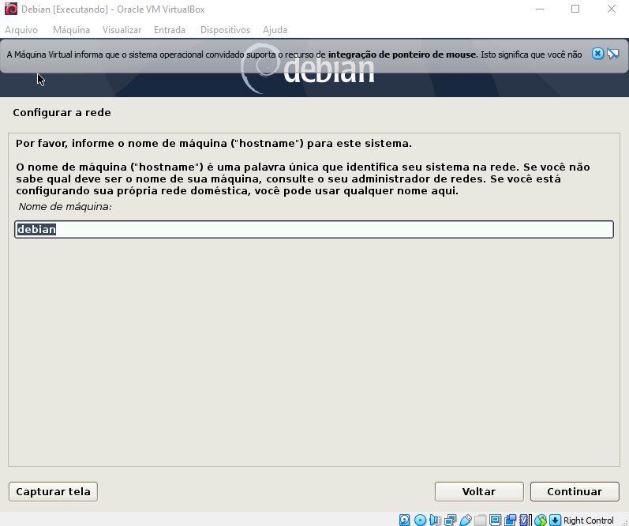
    

  
14 - Escolha um nome de usuario

  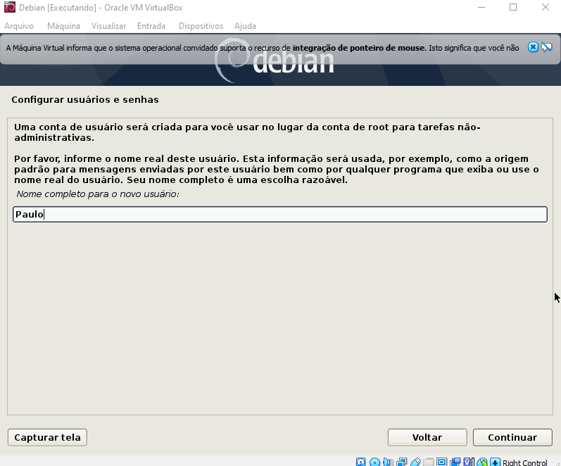
    

   
15 - Use a opção de "Usar o disco inteiro", para uma instalação mais simplificada.

  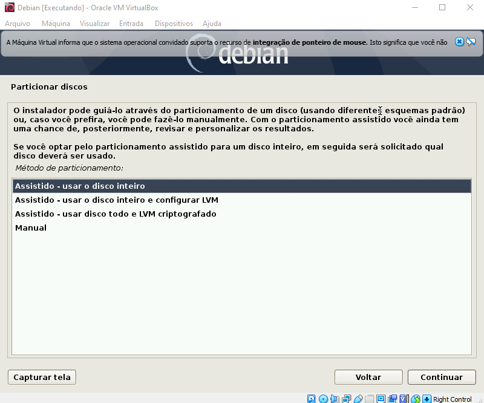
    

   
16 - Escolha a opção de "Partições /home,/var e /tmp..", por se tratar de um hambiente de teste.

  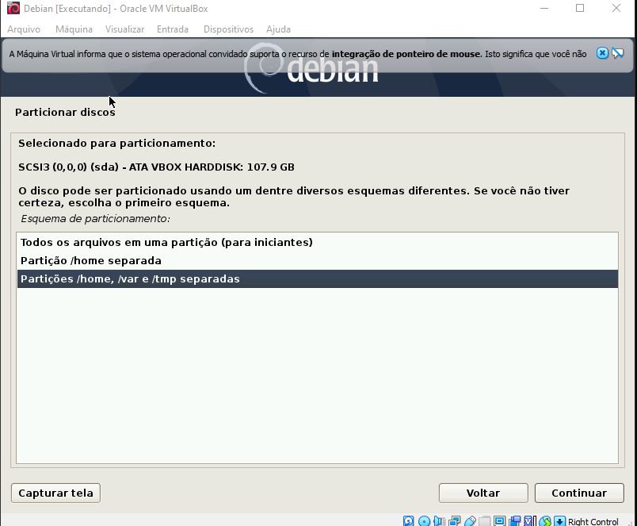
    

  
17 - Sera apresentado uma tela para fazer algumas configurações de particionamento. Clique na opção "Finalizar o particionamento...".

  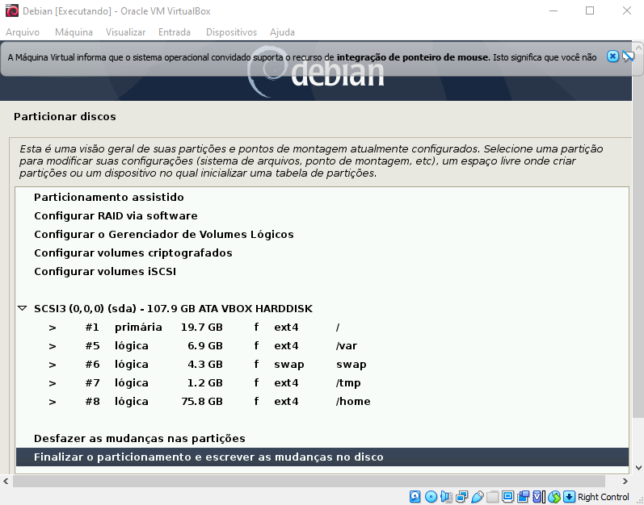
    

  
18 - Logo após se estiver tudo certo confirme marcando a opção "sim".

  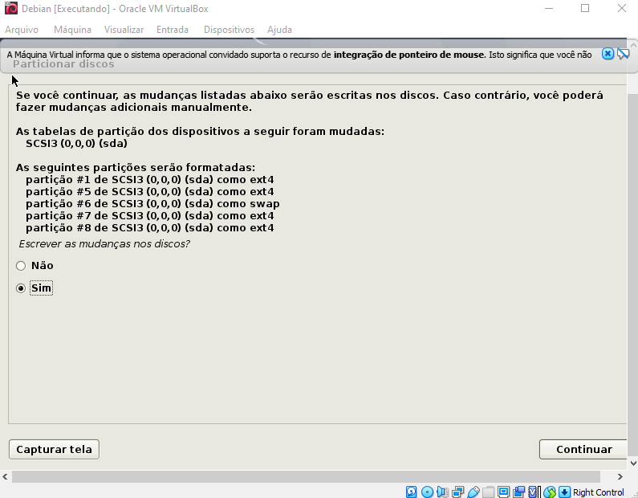
    

  
 

